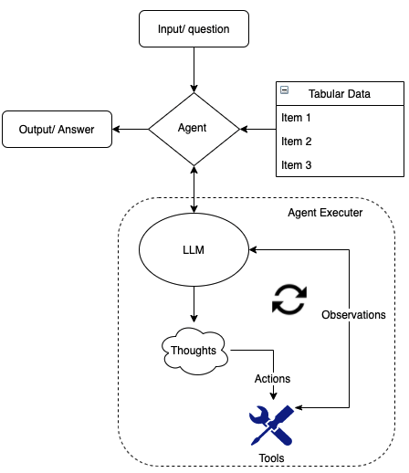

This repository demonstrates how to utilize LangChain Agents and large language models (LLMs) to extract insights from numeric tabular data through natural language queries. We specifically focus on the AWS Cost and Usage Report (CUR) as our data source in this example.

### OpenAI API 
The OpenAI API is a powerful tool for natural language processing tasks, allowing users to generate text, answer questions, and perform other language-related tasks. To access the API, users must obtain an API key, which can be obtained by signing up for OpenAI's API service on their website. Once signed up, users can generate an API key to use with the API. The key can be used to access a range of language models, including GPT-4 and other models tailored to specific use cases.

### LangChain 
LangChain is an innovative framework that improves LLMs for diverse applications. Although LLMs handle various tasks effectively, they may struggle in specialized domains like finance or engineering, where deep knowledge is essential. LangChain overcomes this limitation with a flexible platform, enabling developers to create tailored solutions that combine LLM strengths with domain expertise. This results in more accurate, nuanced responses for specialized tasks, making it a powerful and effective language-based tool.

#### What is a LangChain Agent?
Some applications may require more than just a predetermined series of calls to large language models or other tools, but instead a flexible chain that depends on the user's input. In these chains, an "agent" is available, having access to a variety of tools. Based on the user input, the agent can decide which of these tools, if any, should be used. LangChain have created purpose built agents applied to a particular use case such as Pandas Dataframe Agent which uses Python REPL tool to execute commands provided by the LLM. 

#### What is LangChain Python REPL tool? 
REPL stands for Read-Eval-Print Loop, an interactive programming environment that allows users to execute single lines of code and receive immediate feedback. In some cases, for complex calculations, it can be more efficient to have an LLM generate the code to compute the answer rather than produce the answer directly. To facilitate this, LangChain offers a simple Python REPL that executes commands, allowing users to obtain the results they need with ease.

#### How Do LangChain Agents Work with LLMs Behind the Scenes?
When a LangChain Agent receives input in the form of a question, it initiates an "Agent Executor" chain. Agent Executors manage the agent's tools, determining which ones to call and in what sequence. In this case, the agent is the Pandas DataFrame Agent, and the tool is the Python REPL.

The Agent Executor chain comprises Thoughts, Actions, and Observations. Thoughts are driven by the LLM, which then provides an Action for the agent to access the Python REPL tool and execute a specific command. After the agent executes the command using the tool, an Observation is passed back to the LLM for evaluation. The LLM generates another Thought, followed by an Action, until it predicts that the agent and the tool have produced the correct answer. 

Agent Executors provide flexibility in managing agents. For instance, they can limit the number of steps an agent takes, ensuring that agents do not go out of control and perform excessive actions. This capability is valuable in maintaining efficiency and preventing potential issues in the process.




## Install the dependencies 
This creates a Conda env named `langchain-aws-service-openai` and activates it.
```bash
conda deactivate
conda env create -f environment.yml # only needed once
conda activate langchain-aws-service-openai
```


## Build and Push the Docker image to AWS ECR repository: 

Use the following steps to authenticate and push an image to your repository. For additional registry authentication methods, including the Amazon ECR credential helper, see Registry Authentication .

### 1- Retrieve an authentication token and authenticate your Docker client to your registry.
Use the AWS CLI:

```bash
aws ecr get-login-password --region <AWS_region> | docker login --username AWS --password-stdin <account_id>.dkr.ecr.<AWS_region>.amazonaws.com/llm-cur:latest

```
Note: If you receive an error using the AWS CLI, make sure that you have the latest version of the AWS CLI and Docker installed.

### 2- Build your Docker image using the following command. For information on building a Docker file from scratch see the instructions here . You can skip this step if your image is already built:

```bash
docker build -t llm-cur .
```

### 3- After the build completes, tag your image so you can push the image to this repository:

```bash
docker tag llm-cur:latest <account_id>.dkr.ecr.<AWS_region>.amazonaws.com/llm-cur:latest
```

### 4- Run the following command to push this image to your newly created AWS repository:
```bash
docker push <account_id>.dkr.ecr.<AWS_region>.amazonaws.com/llm-cur:latest

```
## Deploy the Docker container to AWS ECS:
For more details please visit the AWS documentation https://docs.aws.amazon.com/AmazonECS/latest/developerguide/ecs_run_task.html

### 1. Create an ECS cluster:
- Open the Amazon ECS console.
- Choose "Create Cluster".
- Select the cluster template (e.g., "EC2 Linux + Networking") and click "Next step".
- Provide a cluster name and configure other settings as needed.
- Click "Create" to create the cluster.

### 2. Create a task definition:
- In the Amazon ECS console, choose "Task Definitions" from the navigation pane, and then click "Create new Task Definition".
- Select "EC2" as the launch type compatibility and click "Next step".
- Provide a task definition name and configure other settings such as the task role, network mode, and container definitions.
- Under "Container Definitions", click "Add container".
- Provide a container name, and enter the image URI from your ECR repository (e.g., <account_id>.dkr.ecr.<AWS_region>.amazonaws.com/llm-cur:latest).
- Configure other container settings, such as memory limits, port mappings, and environment variables.
- Click "Add" to add the container to the task definition, and then click "Create" to create the task definition.

### 3. Run a task using the task definition:
- In the Amazon ECS console, choose "Clusters" from the navigation pane, and then select the cluster you created earlier.
- Click the "Tasks" tab, and then click "Run new Task".
- Select the "EC2" launch type and choose the task definition you created in step 2.
- Configure other settings such as the VPC, security groups, and IAM role.
- Click "Run Task" to launch the task.

### 4. Access the task's public IP:
- In the "Tasks" tab of your cluster, click on the task ID of the running task.
- In the "Task Details" section, you'll find the "Public IP" address of the task. Use this IP address to connect your local Streamlit app to the deployed Docker container.


## Run the local Streamlit UI 
### Move to the webapp directory
```bash
cd webapp
```

### Update the `<your-api-endpoint>` in `api.py` to the ECS task public IP 

### Start the web application
```bash
streamlit run app.py
```

